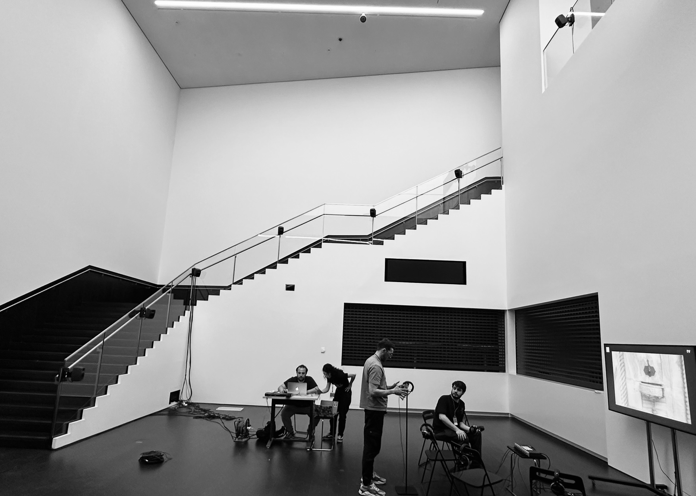

# Listening to Latentscape
*2025 - MaxMSP, RAVE, ambisonics*

This piece is based on continuous soundwalk recordings I made in Istanbul, during walks carried out with Fulya Uçanok as part of our Soundinit initiative. These recordings capture the real-time ambient sounds of the city—not by seeking out specific events or keynote sounds, but by simply walking and listening. As a result, the material is inherently noisy, layered, and unpredictable. I used this raw urban soundscape to train RAVE, a neural synthesis model developed at IRCAM. Because the source lacks clear acoustic patterns, the AI learns to generate similarly textured and ambiguous sonic material. In performance, I present both the original recordings and the AI-generated sounds in a multichannel format, applying the same electroacoustic transformations to both. The result blurs the line between real and artificial soundscapes, and also between our expectations of city sounds and their reality.

4-channel stems available upon request.

# Decomposed Crowd: A Sketch for Forty Voices
*2025 - Installation, SuperCollider, FluCoMa, multichannel*

The sonic material of this piece is derived from field recordings captured during the audience's anticipation period at the Xenakis Centenary Symposium in 2022. These recordings were subjected to spectral decomposition using the Non-negative Matrix Factorization (NMF) algorithm, as implemented in the FluCoMa (Fluid Corpus Manipulation) library within the SuperCollider environment. The resulting dataset was segmented into 40 distinct components representing latent sonic features. Selected components yield timbres that are abstract in nature, yet exhibit spectral characteristics reminiscent of vocal formants.

8-channel stems available upon request.

# Live Networked Music 
*2024 - Gendy Cloud, web audio, Csound, networked music*

<iframe width="560" height="315" src="https://www.youtube.com/embed/FB1XJBtLh58?si=hb4GQt7N_XfgbZ-b" title="YouTube video player" frameborder="0" allow="accelerometer; autoplay; clipboard-write; encrypted-media; gyroscope; picture-in-picture; web-share" referrerpolicy="strict-origin-when-cross-origin" allowfullscreen></iframe>

A *Gendy Cloud* performance based on remote improvisation.

Performers:  
Arda Eden - Istanbul (Turkey)  
Giovanni Bedetti - Urbino (Italy)  
Manolis Ekmektsoglou - Istanbul (Turkey)  
Serkan Sevilgen- Istanbul (Turkey)  
Tarmo Johannes - Tallinn (Estonia)  
Umut Eldem - Antwerp (Belgium)  

# Live Coding
*2024 - Live coding, Supercollider, Flucoma*

<iframe width="560" height="315" src="https://www.youtube.com/embed/5ODq_OnWZ-I?si=QiyOdw7rUvmFSM1x" title="YouTube video player" frameborder="0" allow="accelerometer; autoplay; clipboard-write; encrypted-media; gyroscope; picture-in-picture; web-share" referrerpolicy="strict-origin-when-cross-origin" allowfullscreen></iframe>

Noise_Media Art's new program OI_Sonic, developed in partnership with ITU MIAM.

Built in the 19th century as the Church of Notre Dame du Rosaire, the iconic building that now operates as Yeldeğirmeni Sanat will host performances and workshops on January 20-21

# Live Coding
*2024 - Live coding, Supercollider, Flucoma*

<iframe width="560" height="315" src="https://www.youtube.com/embed/8-5k5Qdl9y0?si=y8eHlt-X5ZyzZhfn" title="YouTube video player" frameborder="0" allow="accelerometer; autoplay; clipboard-write; encrypted-media; gyroscope; picture-in-picture; web-share" referrerpolicy="strict-origin-when-cross-origin" allowfullscreen></iframe>

“Compophonic Sessions Vol. 1” A live computer music event  
Venue: İTÜ MIAM Gallery, Istanbul  
Date/time: 23 May 2024, 19:00  

# Aeolian Resonz 

*2023 - Fixed media, soundscape, sonification, Arduino, Csound*

<https://soundcloud.com/serkansevilgen/aeolian-resonz-2023-10-11>

The sound work explores the natural phenomenon of wind as a perceptual agent acting on various human senses. Tactile sensation is the primary means through which we experience wind. The touch receptors in our skin detect the pressure and movement of air. This tactile sensation can differ based on the strength of the wind, ranging from a gentle caress to a forceful push. Wind also influences our perception of temperature. It can produce sounds as it moves through trees, leaves, grass, buildings, and other obstacles. The rustling of leaves, the creaking of branches, and the howling during strong winds are auditory experiences linked with wind. The speed and direction of the wind can alter the pitch and intensity of these sounds. Differences in atmospheric pressure cause air to move from one location to another over various distances, with different intensities and durations. The work employs data collected by the artist with microcontrollers and air pressure sensors. This data highlights the direction and speed of the "virtual" wind, which is a primary controller in the musical design.

# Nophesis

*2023 - Fixed media, algorithmic composition, soundscape*

<https://soundcloud.com/serkansevilgen/soundscape-w-urban-birds-and-noise>

The sound materials for the piece are the recorded sounds in Istanbul. Two sets of recordings, birds and human-made noises, hint different nature of sounds we hear in the city. The audio samples are matched randomly to create pairs. Spectral analysis and resynthesis tools in Csound are used to generate cross-synthesized sounds where the amplitude and frequency values from each audio are mashed together. 

# Gendy Cloud

*2022 - Networked music, multichannel, web interface, Csound*  

The "Gendy Cloud" is a networked, multichannel music piece that will be realized in real time by a telematic ensemble. Performers are composers, researchers, interface designers, and musicians. The ensemble members could control their instruments remotely by either using their interfaces, custom-built devices, live coding, or a web interface. Any performer can control one or more instances of the Gendy-based instrument. The control parameters are limited to reduce the learning curve and increase the adaptability to the existing interfaces. However, extensive use of stochastic processes in the instrument allows performers to create varied timbre, patterns, and textures in a multichannel diffusion system.  

See details and performance videos [here](https://serkansevilgen.com/projects/gendy-cloud.html)  

# Mar8

*2022 - Fixed media, field recordings, multichannel, Csound*  

<https://soundcloud.com/serkansevilgen/mar8-stereo-mix> (Stereo mix)  

The sound materials for the piece are the recordings of the police helicopters that I made from my home window during the Women’s March at Istiklal Street on March 8th, 2021. I extracted 15 audio files after an hour of recording that you hear a helicopter comes into the soundscape and goes. The sound doesn’t move circularly in 8-channel diffusion but goes across the listening hall from many directions to eventually build up a thick and almost suffocating soundscape above the audience.  

# Sounding Microcosmos at SMC 2022

*2022 - Live electronics, networked music, web audio, Python, Arduino, Csound*  

<iframe width="560" height="315" src="https://www.youtube.com/embed/TTVXINK9gZA?si=Isz2L5HQK6JUC_3U" title="YouTube video player" frameborder="0" allow="accelerometer; autoplay; clipboard-write; encrypted-media; gyroscope; picture-in-picture; web-share" referrerpolicy="strict-origin-when-cross-origin" allowfullscreen></iframe>

A real-time, telematic, biodata sonification project with Ipek Oskay. It was performed at **NIME 2022**, **SMC 22**, **Taking Place and Making Place Conference**, **Earth Day Art Model Telematic Festival**.  

See details and performance videos [here](https://serkansevilgen.com/sounding-microcosmos/)  

# Sounding Microcosmos at Earth Day Art Model Telematic Festival 2022

*2022 - Live electronics, networked music, web audio, Python, Arduino, Csound*  

<iframe width="560" height="315" src="https://www.youtube.com/embed/Ud1cmRxGNIs?si=ngkkJ2Wso7dbBrZR" title="YouTube video player" frameborder="0" allow="accelerometer; autoplay; clipboard-write; encrypted-media; gyroscope; picture-in-picture; web-share" referrerpolicy="strict-origin-when-cross-origin" allowfullscreen></iframe>

A real-time, telematic, biodata sonification project with Ipek Oskay. It was performed at **NIME 2022**, **SMC 22**, **Taking Place and Making Place Conference**, **Earth Day Art Model Telematic Festival**.  

See details and performance videos [here](https://serkansevilgen.com/sounding-microcosmos/)  

# Symphony in Blue 2.0 (w. Istanbul Coding Ensemble)

*2021 - Live Coding, Networked music, SuperCollider*  

<iframe width="560" height="315" src="https://www.youtube.com/embed/L_mgsEHc3KY?si=PxU5vu2R0ioPVqX2" title="YouTube video player" frameborder="0" allow="accelerometer; autoplay; clipboard-write; encrypted-media; gyroscope; picture-in-picture; web-share" referrerpolicy="strict-origin-when-cross-origin" allowfullscreen></iframe>

Istanbul Coding Ensemble (ICE), Jerfi Aji, and Scott Wilson perform “with live coding based on machine listening data shared over network” version of “Symphony in Blue” by composer Kamran Ince.  

Istanbul Coding Ensemble (ICE) is a laptop orchestra of ITU/MIAM and has a focus on improvisation with musical algorithms using ‘just-in-time’ programming techniques and real-time communication with ad-hoc network music systems.  

The recorded performance was presented in the following events:  

-   **Transformations of Musical Creativity in the 21st Century Conference.** (27 June 2021)
-   **18th Brazilian Symposium on Computer Music.** (October 24 - 27 2021)
-   **22nd ISMIR Conference.** (November 8 - 12 2021)
-   **ICLC 2021 - International Conference on Live Coding.** 2021 (December 15-17 2021)
-   **SONIFIED Symposium 2022** (December 29-39 2022)

Live performance  

-   **EELISA Research-based Learning Symposium.** (17-18 May 2022).

<https://www.youtube.com/watch?v=WN5rQFDp3_A>  

# N, for Violin and Electronics

*2021 - Mixed composition, Lilypond, Csound*  

<iframe width="560" height="315" src="https://www.youtube.com/embed/aKCNPT1IOjk?si=ePHyqbfNGFQjkjp2" title="YouTube video player" frameborder="0" allow="accelerometer; autoplay; clipboard-write; encrypted-media; gyroscope; picture-in-picture; web-share" referrerpolicy="strict-origin-when-cross-origin" allowfullscreen></iframe>

# Inside Outside (w. Fulya Ucanok)

*2021 - Mixed music, live electronics, MaxMSP*  

<https://www.youtube.com/watch?v=3zH30QuRSJQ&t=907s>  
<https://soundcloud.com/serkansevilgen/inside-outside-with-fulya-ucanok>  

Presented in **Impro Dance Festival** (27 May 2021). Dancers reacted to the music during a Zoom session.  

Fulya Ucanok ~ inside piano  
Serkan Sevilgen ~ Soundscapes  

# Coding Coppers

*2021 - Live electronics, live Coding, Python, SuperCollider, Arduino*  

<iframe width="560" height="315" src="https://www.youtube.com/embed/2FMzYgew6co?si=1yTLCxVLxHwWd62g" title="YouTube video player" frameborder="0" allow="accelerometer; autoplay; clipboard-write; encrypted-media; gyroscope; picture-in-picture; web-share" referrerpolicy="strict-origin-when-cross-origin" allowfullscreen></iframe>

Live coding is usually associated with computer-based sound generation. In this piece I try to explore the area of live coding for acoustic objects. Live coding with Python language acts as an interface to control the servo motors which are attached to an Arduino board. A microphone picks the sound and a Supercollider-based live coding interface manipulates the sounds gently. The piece is inspired by the work of Andre Valle. However the output is aimed at generating more limited sets of sounds and not excessive manipulation respecting the silent moments.  

Presented at [**ICMC 2022**](https://icmc2022.files.wordpress.com/2022/07/icmc2022_programme.pdf).  

# The Curtain and Beyond (w. Fulya Ucanok)

*2020 - live electronics, Csound*  

<iframe width="560" height="315" src="https://www.youtube.com/embed/u9f-rb_YWTo?si=Thf4gOPWFC8K1I6I" title="YouTube video player" frameborder="0" allow="accelerometer; autoplay; clipboard-write; encrypted-media; gyroscope; picture-in-picture; web-share" referrerpolicy="strict-origin-when-cross-origin" allowfullscreen></iframe>

In this performance, the duo delves into the discourses around the Pythagorean curtain that has been an inspiration for the acousmatic tradition. Taking it literally, the performance integrates an actual curtain in physical space performance conditions, However, they use other virtual tools to create the curtain for network performances. The curtain aims to weave together historical and current discourses around acousmatic music practice. Integrating the acousmatic into a live performance setting, they create dialogues between parallel worlds of source-bonded/source-ambiguous sound events, various forms of presences/absences, the real/unreal, and linearity/non-linearity in the narrative.  

Performed live at the [Network Music Festival](https://networkmusicfestival.org/programme/performances/fulya-ucanok-and-serkan-sevilgen-the-curtain-and-beyond/), 2020  

# Transfigured Walls

*2020 - Fixed media, binaural, Csound*  

<https://soundcloud.com/serkansevilgen/transfigured-walls-a-binaural-acousmatic-piece-use-earphones>  

During the COVID-19 pandemic composers and musicians persevere with producing new works. However, since the only distribution channel is online we lost the ability to create multichannel music that we can design a spatial experience in physical venues. In this fixed media piece, I deliberately target the audience that consumes music with earphones. I used Csound’s HRTF (Head Related Transfer Function) opcodes to create a virtual binaural space that I can specify the dimensions of the room, reflection coefficients of the walls, floor, and ceiling. The listener would enjoy the 3D soundstage with moving sounds in all dimensions.  

It was presented during the **Share the Sound Concert** (2020) and **Tehran International Electronic Music Festival** (2022)  

# Image sonification in memoriam Ertuğrul Oğuz Fırat

*2020 - Fixed media, Python, Csound*  

<https://soundcloud.com/serkansevilgen/image-sonification-in-memoriam-ertugrul-oguz-firat>  

This piece was composed in memory of the Turkish composer, painter, and poet Ertuğrul Oğuz Fırat (1923-2014). One of the composer’s paintings, Politika, is used as a material for the image sonification. The RGB (red, green, blue) channel data of each pixel in Politika was read with Python programming language. In Csound, image data is mapped to several parameters to reveal the patterns in the painting in the rhythmic texture.  

It was presented during the homage concert on 10 February 2020 at **ITU/MIAM Library** and **SIIDS - Sound, Image and Interaction Design Symposium** (2020)  

# Wanderer

*2019 - Fixed media, multichannel, Csound*  

<https://soundcloud.com/serkansevilgen/octophonic-site-specific-piece-for-the-miam-gallery> (Stereo render)  

This piece is composed for an 8-channel diffusion system in which speakers are spread through MIAM Gallery. Works for the concert are site-specific, composed for a bespoke multichannel diffusion system, making the event fall somewhere between an installation and a concert. Attendees are encouraged to move around to tailor their audio-spatial experience. The piece is consists of distinct sections that I explore different sonic textures. The sections are self-contained and don’t present a particular progression. The musical material is laid out and sufficient time is given to the listener to consume the possibilities in limited musical material. The piece was composed solely in Csound.  

It was presented during the “Sonic Tales from the Crypt” concert on 26 December 2019 at **ITU/MIAM Gallery** and in the **Festival of Sound Art and Transmedia Ecos Urbanos (Mexico and CCRMA/Stanford)**  

# Spectral Collage

*2019 - Sound Installation, MaxMSP, field recordings*  

<https://soundcloud.com/serkansevilgen/spectral-collage-render-1>  

Proof-of-concept render of a sound installation work that is supposed to be run for the duration of an exhibition. Layers of sounds from field recordings of a city/site are torn down gradually with a very steep-sloped, brick wall type filter. After a while what we hear is slow but everchanging frequencies which any audio layers can hardly be distinguishable.  

# Strng Wnd

*2019 - Fixed media, Soundscapes*  

<https://soundcloud.com/serkansevilgen/strng-wnd>  

"I try to detect and record soundscapes that resemble my ideas of sound design and composition. Awareness of sonic environment and making decisions, what and how to record makes recording more like a compositional process. In this track I have removed the wind shield from Sennheiser MKH 416 shotgun microphone and exposed it to a very strong wind."  

Presented at the **Istanbul Soundscape Concert** (2019)  

# Released soundscapes

Two soundscape pieces published in the 2013 World Listening Day compilation by Sonic Field.  
Sonic Field is a bilingual, interdisciplinary network around sonic arts, sound studies and aural culture.  
<http://sonicfield.org>  

-   <https://sonicterrain.bandcamp.com/track/istanbul-subway>
-   <https://sonicterrain.bandcamp.com/track/istanbul-gezi-park-protests>

# Binaural Recordings of Soundinit Soundwalks

<https://soundcloud.com/serkansevilgen/sets/soundinit-soundwalks>  

# Various Field Recordings

Mono, stereo and binaural field recordings over the years  

<https://soundcloud.com/serkansevilgen/sets/field-recordings>  

# Footnotes

<a id="fn.1" href="#fnr.1">1</a> <https://xenakis2022.uoa.gr/>
